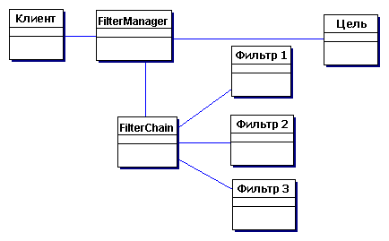

# Абстрактные классы и интерфейсы 

6.3. Фильтр

Задача
--------

Напишите метод filter, который принимает на вход массив (любого типа) и реализацию интерфейса Filter c методом apply(Object o), чтобы убрать из массива лишнее.
Проверьте как он работает на строках или других объектах.

Пример паттерна "Фильтр". ( ´ ω ` )

Решение:
--------
Обычно, я даю эту задачу еще до Generics, поэтому студенты пишут метод без них, используя Object:

    interface Filter {
    boolean apply(Object o);
    }
    
    public class Main {
    
        public static Object[] filter(Object[] array, Filter filter) {
            int offset = 0;
    
            for(int i = 0; i< array.length; i++){
                if(!filter.apply(array[i])){
                    offset++;
                } else{
                    array[i - offset] = array[i];
                }
            }
    
            // Arrays.copyOf копирует значение из массива array в новый массив
            // с длинной array.length - offset
            return Arrays.copyOf(array, array.length - offset);
        }
    
        public static void main(String[] args) {
            String array[] =
                    new String[]{"1rewf ", "feefewf", "a", null, "1"};
    
            String[] newArray =  (String[]) filter(array, new Filter() {
                @Override
                public boolean apply(Object o) {
                    return o != null;
                }
            });
        }
    }

Но, можно и с Generics. Тогда можно использовать стандартный Function:

    public class Main {
    
        public static <T> T[] filter(T[] array, Function<? super T, Boolean> filter) {
            int offset = 0;
    
            for (int i = 0; i < array.length; i++) {
                if (!filter.apply(array[i])) {
                    offset++;
                } else {
                    array[i - offset] = array[i];
                }
            }
    
            // Arrays.copyOf копирует значение из массива array в новый массив
            // с длинной array.length - offset
            return Arrays.copyOf(array, array.length - offset);
        }
    
    
        public static void main(String[] args) {
            String array[] =
                    new String[]{"1rewf ", "feefewf", "a", null, "1"};
    
            String[] newArray = filter(array, s -> s != null);
        }
    }